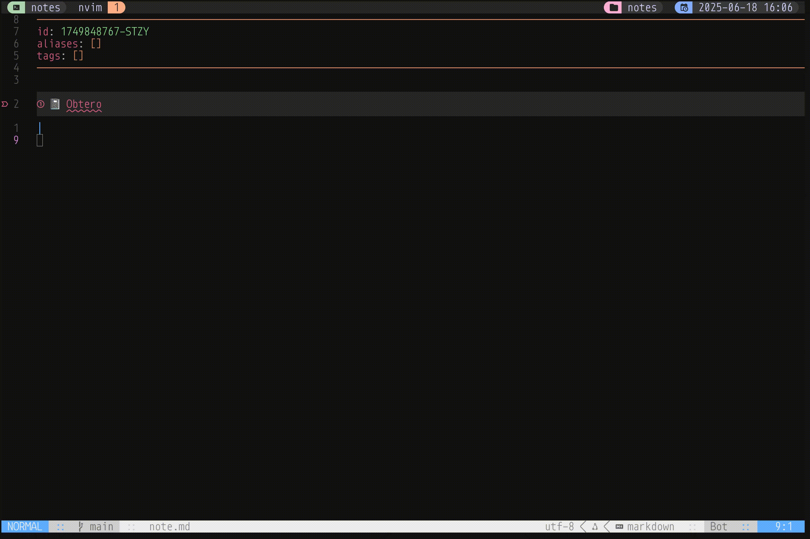

<h1 align="center">Obtero</h1>

<p align="center">
  
  
  <a href="LICENSE">
    
  </a>
  <br />
  <a href="https://github.com/maxardito/obtero.nvim/releases">
    
  </a>
  <a href="https://github.com/maxardito/obtero.nvim/actions/workflows/test.yml">
    
  </a>
</p>

--- 
Obtero is an extension for `obsidian.nvim` that allows you to cite papers, import notes, and populate Obsidian notes using data from your Zotero library. It's loosely modeled off of the [obsidian-zotero-integration](https://github.com/mgmeyers/obsidian-zotero-integration) plugin for the Obsidian UI.




## 🥜 Features

- Browse and search your Zotero collection in Neovim
- Insert inline citations directly into your notes, as well as formatted references (IEEE, Chicago, MLA)
- Auto-generate templates with reference metadata using Obsidian's template command
- Populate Obsidian notes with Zotero tags

## 🛍️ Requirements

The minimum requirements for Obtero are:

1. `nvim` >= v0.11.1
2. `sqlite3` >= 3.48.0
3. `zotero.sqlite3` and `better-bibtex.sqlite3` that contain your Zotero metadata
4. `obsidian.nvim` with a picker of your choice

By default, Zotero will store these files in your Zotero data directory (`~/Zotero`)

## 🏗️ Install

### lazy.nvim

```
  {
    "maxardito/obtero",
    dependencies = {
      "epwalsh/obsidian.nvim",
    },
    opts = {
      zotero = {
        path = "~/Zotero", -- Path to Zotero root directory 
        bibstyle = "ieee", -- Bibliography style (options: ieee, chicago, mla)
      },
      -- Sets all url fields to redirect to a url field instead of a local Zotero PDF 
      url_redirect = false,
      picker = {
        -- Optional, configure key mappings for the picker. These are the defaults.
        -- Not all pickers support all mappings.
        note_mappings = {
          -- Create a new note from your query.
          new_from_template = "<C-t>",
          -- Insert a link to the selected note.
          insert_inline_citation = "<C-l>",
          insert_full_citation = "<C-z>",
        },
      },
    }
  }
```

## ⌨️ Commands

#### `ObteroDataExplorer`
Opens up a pop-up window that displays a given Zotero entry's metadata fields, loosely modeled off of the data explorer view from the [obsidian-zotero-integration](https://github.com/mgmeyers/obsidian-zotero-integration) plugin.

#### `ObteroNewFromTemplate`
Populates an Obsidian template file with fields from a selected Zotero entry. Location of template files can be defined in the `obsidian.nvim` config file.

#### `ObteroInlineCitation`
Generates an inline citation based on a Zotero entry's key. Inline citations also contain hyperlinks to either the PDF or URL of the entry, if one exists.

#### `ObteroReferenceCitation`
Generates a full bibliographic citation following a chosen style guide and inserts it into the current Obsidian note.

#### `ObteroInsertTags`
Inserts tags from a given Zotero entry into the current Obsidian note.

## 🗺️ Roadmap

This project is the result of a lot of procrastination while writing academic articles. I'd love for it to continue growing, and thus welcome PRs and issues. Some known places for improvement are:

- Integrating and testing a wider array of Zotero entry types (so far only Journal Entries and Books are fully accepted).
- Triple checking all edge cases for missing citation fields info to avoid redundant punctuation.
- Feature supporting Zotero note export.

## Acknowledgements

The design choices here follow the structure of both [obsidian.nvim](https://github.com/epwalsh/obsidian.nvim) and [obsidian-zotero-integration](https://github.com/mgmeyers/obsidian-zotero-integration), so shout out to those who have contributed to those projects.
